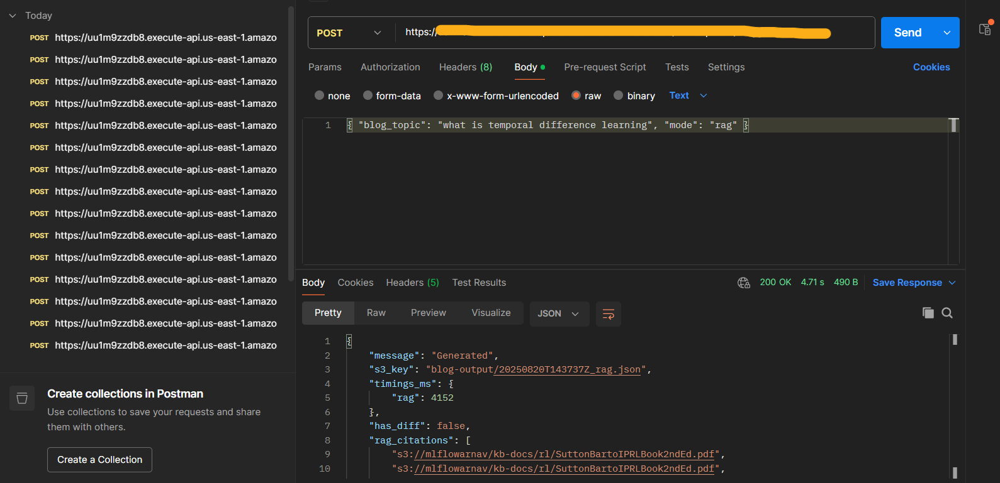

# AWS Bedrock Blog Generators (Vanilla + RAG) — Mono-Repo

This repository contains two AWS Lambda projects that generate blog posts using Amazon Bedrock and store the outputs in Amazon S3. The functions can be triggered via an API client (e.g., Postman) through API Gateway.

1. **Project A — Simple Blog Generator (Vanilla LLM)**  
   - Lambda function that takes a `blog_topic`, calls a Bedrock foundation model, and uploads the generated text to S3.  
   - File: `lambda_simple_blog.py`

2. **Project B — RAG vs. Vanilla Comparator**  
   - Lambda function that can run **vanilla** generation *and/or* **RAG** (via Bedrock Knowledge Bases), records timings, persists artifacts (JSON, Markdown, optional `.diff`) to S3, and returns a compact API response.  
   - File: `lambda_rag_compare.py`

---

## Features

- **Bedrock integration** 
- **Vanilla vs. RAG** comparison 
- **S3 artifacting** for all outputs
- **Compact JSON API responses**
- **Environment variable configuration**

---

